# Enterprise AI Invoice Reconciliation Engine and Audit Platform

## Overview

The Enterprise AI Invoice Reconciliation Engine is an autonomous multi-agent platform designed to automate accounts payable audits. It ingests multi-format vendor bills (digital PDFs, scanned images, plain text), extracts structured data using Groq's flagship 120B model (openai/gpt-oss-120b), validates financial mathematics through deterministic guardrails, and matches vendor bills against internal purchase orders using a 3-tier hybrid retrieval engine (SQL, RapidFuzz, and ChromaDB ONNX Vector Search).

Operating on a stateful LangGraph state machine, the system auto-approves matching bills (<5% variance), routes minor discrepancies (5-15% variance) to a Streamlit Human Review Dashboard, and auto-rejects high-variance or invalid bills (>15% variance).

---

## Key Features

- **Stateful Multi-Agent Orchestration:** Built on LangGraph StateGraph with checkpointing and error state routing.
- **Multi-Modal Document Parsing:** Processes digital PDFs, text files, and scanned images (PNG, JPG) using PaddleOCR and PyTesseract OCR engines.
- **Flagship 120B LLM Extraction:** Parses unstructured document text into strict JSON using Groq LPU acceleration (openai/gpt-oss-120b) via LangChain init_chat_model.
- **Offline Fallback Engine:** Features a local regex and pattern-matching parser that maintains system availability during cloud LLM API outages.
- **Deterministic Financial Guardrails & Normalizer:** Sanitizes string amounts, verifies mandatory Pydantic schema keys, and enforces mathematical integrity (sum of item totals + GST == Total Amount) before database entry.
- **3-Tier Hybrid Retrieval Engine:** Combines exact SQL lookup, RapidFuzz vendor candidate ranking, and ChromaDB dense ONNX vector embeddings for semantic product matching.
- **Model Context Protocol (MCP) Integration:** Exposes standardized database tools to an AI Chatbot Assistant for natural language dashboard queries.
- **Real-Time Audit Dashboard:** Streamlit UI providing real-time metric cards, side-by-side human review drawers, and live response streaming (st.write_stream).

---

## Workflow Diagram

```mermaid
flowchart TD
    subgraph INGESTION["1. Document Ingestion and Isolation Layer"]
        A1["Incoming Invoice Upload<br/>(PDF / PNG / JPG / TXT)"] --> A2["Folder Watcher / Dashboard<br/>(folder_watcher.py / dashboard_app.py)"]
        A2 --> A3["Intake Agent<br/>(intake_agent.py)"]
        A3 --> A4["Generate UUID Tracking ID<br/>(PRC-XXXXXXXX)"]
        A4 --> A5["Isolate File Copy<br/>(/processing)"]
        A5 --> A6[("SQLite Transaction Log<br/>State: INTAKE")]
    end

    subgraph EXTRACTION["2. File Detection and Extraction Layer"]
        A5 --> B1["File Detection Agent<br/>(file_detection_agent.py)"]
        B1 -- ".txt / Digital PDF Stream" --> B2["Direct Text Parser<br/>(pypdf / built-in)"]
        B1 -- "Image Scan (.png/.jpg)" --> B3["OCR Engine Service<br/>(ocr_engine.py - PaddleOCR / PyTesseract)"]
        
        B3 --> B4["Raw Text Stream"]
        B2 --> B4
        
        B4 --> B5["Structured Extraction Agent<br/>(extraction_agent_llm.py)"]
        B5 -- "Call Groq API (init_chat_model)" --> B6["Groq Text Model<br/>(openai/gpt-oss-120b)"]
        
        B6 --> B9["Structured Extracted JSON"]
        B5 -- "API Timeout / Outage" --> B10["Offline Regex Parser<br/>(_offline_fallback_parse)"]
        B10 --> B9
    end

    subgraph VALIDATION["3. Guardrails and Business Validation Layer"]
        B9 --> C1["Schema Guardrails & Normalizer<br/>(guardrails/validators.py)"]
        C1 --> C2{"Pydantic & Financial Math Verification<br/>sum(items) + GST == Total"}
        
        C2 -- "Math Check Failed" --> C3["Workflow Halted<br/>State: VALIDATION_FAILED"]
        C3 --> A6
        
        C2 -- "Math Passed" --> C4["Business Validation Agent<br/>(validation_agent.py)"]
        C4 --> C5{"Business Rules Verification<br/>Duplicate Check / Date Sanity"}
        
        C5 -- "Duplicate / Future Date" --> C3
        C5 -- "Business Rules Passed" --> C6[("SQLite State Update<br/>State: VALIDATED")]
    end

    subgraph RETRIEVAL["4. 3-Tier Hybrid Reference Retrieval Layer"]
        C6 --> D1["Company Retrieval Agent<br/>(retrieval_agent.py)"]
        D1 --> D2{"Tier 1: Exact SQL Lookup<br/>WHERE invoice_no = ?"}
        
        D2 -- "Exact PO Match Found" --> D5["Reference PO Record"]
        D2 -- "No Exact Match" --> D3{"Tier 2: RapidFuzz Candidate Ranking<br/>Vendor Name + Date/Amount Score"}
        
        D3 -- "Fuzzy PO Match Found" --> D5
        D3 -- "No Fuzzy Match" --> D4["Tier 3: ChromaDB Dense Vector Search<br/>(vector_service.py - ONNX Embeddings)"]
        D4 --> D5
    end

    subgraph DECISION["5. Matching and Policy Decision Engine Layer"]
        D5 --> E1["Matching Agent<br/>(matching_agent.py)"]
        E1 --> E2["Compute Variance and Score<br/>Amount Variance % + RapidFuzz Ratio"]
        E2 --> E3["Decision Agent<br/>(decision_agent.py)"]
        
        E3 --> E4{"Policy Threshold Evaluation"}
        
        E4 -- "Variance <= 5.0% and Match >= 80%" --> F1["Decision: APPROVED<br/>Move file to /processed"]
        E4 -- "5.0% < Variance <= 15.0%" --> F2["Decision: HUMAN_REVIEW<br/>Move file to /human_review"]
        E4 -- "Variance > 15.0%" --> F3["Decision: REJECTED<br/>Move file to /rejected"]
        
        F1 & F2 & F3 --> F4[("SQLite Final Audit Log<br/>State: DECIDED")]
    end

    subgraph INTERFACE["6. Interactive Audit Dashboard and MCP Chatbot"]
        F4 --> G1["Streamlit Audit Dashboard<br/>(dashboard_app.py)"]
        G1 --> G2["Human Review Side-by-Side Drawer"]
        G1 --> G3["Real-Time Metric Cards"]
        G1 --> G4["AI Chatbot Assistant<br/>(chatbot_agent.py)"]
        G4 --> G5["MCP Tool Registry<br/>(mcp/tool_registry.py)"]
        G5 -- "@tool get_system_summary()<br/>@tool fetch_pending_reviews()" --> A6
    end
```



---

## Project Structure

```
gen-ai-/
├── config/
│   └── settings.py               # Central environment constants and path settings
├── agents/
│   ├── intake_agent.py           # File registration, UUID generation, workspace isolation
│   ├── file_detection_agent.py   # File extension and PDF text stream inspector
│   ├── extraction_agent.py       # Raw text extraction & OCR manager
│   ├── extraction_agent_llm.py   # Groq 120B LLM extraction & regex fallback parser
│   ├── validation_agent.py       # Business validation rules (duplicates, dates, pricing)
│   ├── retrieval_agent.py        # 3-Tier hybrid retrieval engine (SQL, RapidFuzz, Vector)
│   ├── matching_agent.py         # Amount variance & line-item similarity calculator
│   ├── decision_agent.py         # Governance policy decision engine and disk router
│   └── chatbot_agent.py          # MCP chatbot assistant powering Streamlit sidebar
├── ocr/
│   └── ocr_engine.py             # PaddleOCR, PyTesseract, and pypdf extraction service
├── guardrails/
│   ├── schemas.py                # Pydantic schema models
│   └── validators.py             # Schema validation & math verification engine
├── vector_db/
│   └── vector_service.py         # ChromaDB ONNX vector store for product embeddings
├── mcp/
│   └── tool_registry.py          # Model Context Protocol tool definitions (@tool)
├── database/
│   ├── schema.sql                # SQLite relational database DDL schema
│   ├── seed_data.py              # Reference purchase order database seeder
│   └── load_json_to_db.py        # Bulk JSON enterprise invoice loader
├── utils/
│   └── logger.py                 # Centralized logging setup writing to stdout & log files
├── dashboard_app.py              # Streamlit audit dashboard interface
├── main_pipeline.py              # Main Orchestrator built on LangGraph StateGraph
├── folder_watcher.py             # Background directory monitoring daemon
├── image_bill_generater.py       # Generator script for test invoice PNG images
├── pdf_generate.py               # Generator script for test invoice PDF files
├── requirements.txt              # Project Python dependencies
├── packages.txt                  # Linux container system packages for Streamlit Cloud
├── .env.example                  # Environment configuration template
└── README.md                     # Project documentation
```

---

## Technology Stack

- **Orchestration:** LangGraph (StateGraph, MemorySaver)
- **LLM Engine:** Groq LPU Inference (openai/gpt-oss-120b)
- **Unified Standard:** LangChain init_chat_model
- **Vector Storage:** ChromaDB with ONNX DefaultEmbeddingFunction
- **Tool Protocol:** Model Context Protocol (MCP) via LangChain @tool decorators
- **OCR Engine:** PaddleOCR, PyTesseract, pypdf
- **Fuzzy Matching:** RapidFuzz (C++ Levenshtein string scoring)
- **Data Validation:** Pydantic v2
- **Relational Storage:** SQLite3
- **Presentation:** Streamlit (st.write_stream real-time token streaming)
- **Directory Monitoring:** Watchdog daemon

---

## Installation and Setup

### Prerequisites

- Python 3.11+
- Virtual environment (.venv)
- Groq API Key

### Step 1: Clone and Set Up Virtual Environment

```bash
git clone <repository_url>
cd gen-ai-
python -m venv .venv
```

Activate virtual environment:
- Windows (PowerShell): `.venv\Scripts\Activate.ps1`
- Linux/macOS: `source .venv/bin/activate`

### Step 2: Install Dependencies

```bash
pip install -r requirements.txt
```

### Step 3: Configure Environment Variables

Copy `.env.example` to `.env` in the root directory:

```env
GROQ_API_KEY=your_groq_api_key_here
GROQ_MODEL=openai/gpt-oss-120b
GROQ_VISION_MODEL=openai/gpt-oss-120b
MODEL_PROVIDER=groq
```

---

## How to Run the Project

### Option 1: Process a Single Invoice via Main Pipeline (CLI)

```bash
python -c "from main_pipeline import ReconciliationPipelineEngine; engine = ReconciliationPipelineEngine(); engine.process_document('incoming_invoices/sample_bill.pdf')"
```

### Option 2: Launch the Streamlit Audit Dashboard

```bash
streamlit run dashboard_app.py
```

Open your browser at `http://localhost:8501` to view metrics, upload invoices, review pending bills, and interact with the MCP AI Chatbot.

### Option 3: Run the Background Directory Watcher

```bash
python folder_watcher.py
```

Any file dropped into `incoming_invoices/` will automatically trigger full pipeline reconciliation.

---

## Deployment on Streamlit Community Cloud

1. Push your repository to GitHub (ensure `requirements.txt`, `packages.txt`, and `dashboard_app.py` are included).
2. Log into share.streamlit.io using GitHub.
3. Click "New app", select your repository, main branch, and set main file path to `dashboard_app.py`.
4. Under Advanced Settings -> Secrets, add your environment variables:
   ```toml
   GROQ_API_KEY = "your_groq_api_key_here"
   GROQ_MODEL = "openai/gpt-oss-120b"
   MODEL_PROVIDER = "groq"
   ```
5. Click "Deploy!".

---

## Decision Policy Thresholds

- **Variance <= 5.0% and Match Score >= 80%:** Auto-Approved (File moved to `/processed`).
- **5.0% < Variance <= 15.0%:** Human Review Required (File moved to `/human_review` and flagged on Streamlit queue).
- **Variance > 15.0%:** Auto-Rejected (File moved to `/rejected`).

---

## License and Maintainer

This project is maintained as an enterprise AI invoice reconciliation engine. Developed for automated accounts payable auditing and multi-agent workflow research.
